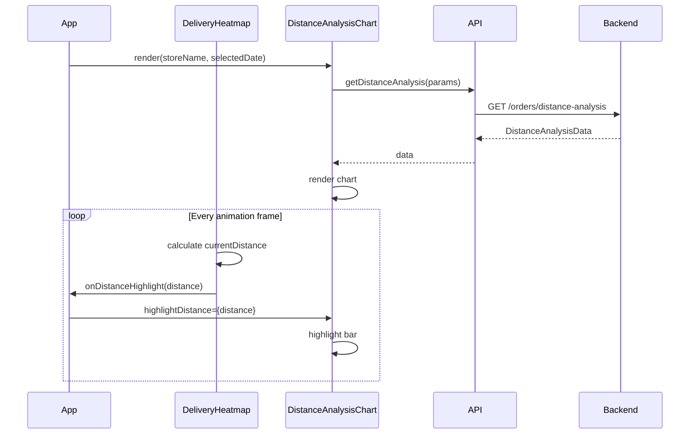
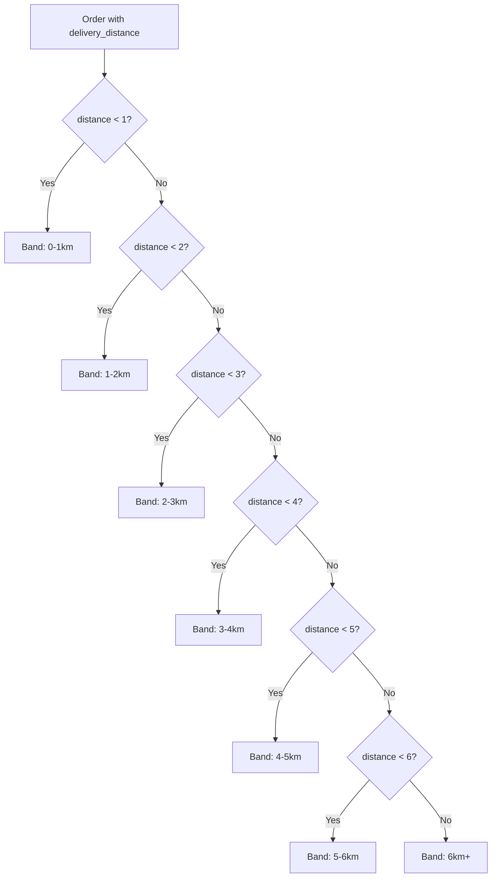

# Design Document: 分距离订单诊断 (Distance-based Order Diagnosis)

## Overview

本设计文档描述"分距离订单诊断"功能的技术实现方案。该功能通过分析不同配送距离区间的订单表现，帮助业务人员识别最优配送范围和成本问题。

核心特性：
- 后端API提供7个距离区间的订单指标聚合
- 前端图表组件展示柱状图(订单数) + 折线图(利润)
- 与配送溢价雷达(DeliveryHeatmap)实时联动

## Architecture

```
┌─────────────────────────────────────────────────────────────────┐
│                         Frontend (React)                         │
├─────────────────────────────────────────────────────────────────┤
│  App.tsx                                                         │
│  ├── highlightDistance state (number | null)                    │
│  ├── DeliveryHeatmap (onDistanceHighlight callback)             │
│  └── DistanceAnalysisChart (highlightDistance prop)             │
├─────────────────────────────────────────────────────────────────┤
│  api/orders.ts                                                   │
│  └── getDistanceAnalysis(params) → Promise<DistanceAnalysisData>│
├─────────────────────────────────────────────────────────────────┤
│  types/index.ts                                                  │
│  ├── DistanceBandMetric                                         │
│  └── DistanceAnalysisData                                       │
└─────────────────────────────────────────────────────────────────┘
                              │
                              ▼ HTTP GET
┌─────────────────────────────────────────────────────────────────┐
│                      Backend (FastAPI)                           │
├─────────────────────────────────────────────────────────────────┤
│  /api/v1/orders/distance-analysis                               │
│  ├── Query params: store_name, channel, target_date, etc.       │
│  ├── Load orders from database (with caching)                   │
│  ├── Group by distance bands (7 ranges)                         │
│  ├── Calculate metrics per band                                 │
│  └── Return DistanceAnalysisData                                │
└─────────────────────────────────────────────────────────────────┘
                              │
                              ▼ SQL Query
┌─────────────────────────────────────────────────────────────────┐
│                      Database (PostgreSQL)                       │
├─────────────────────────────────────────────────────────────────┤
│  orders table                                                    │
│  └── delivery_distance: Float (配送距离，单位：公里)             │
└─────────────────────────────────────────────────────────────────┘
```

## Components and Interfaces

### 1. Backend API Endpoint

**Endpoint:** `GET /api/v1/orders/distance-analysis`

**Query Parameters:**
| Parameter | Type | Required | Description |
|-----------|------|----------|-------------|
| store_name | string | No | 门店名称筛选 |
| channel | string | No | 渠道筛选 |
| target_date | string | No | 目标日期 (YYYY-MM-DD 或 MM-DD) |
| start_date | date | No | 开始日期 |
| end_date | date | No | 结束日期 |

**Response Schema:**
```python
{
    "success": True,
    "data": {
        "distance_bands": [
            {
                "band_label": "0-1km",
                "min_distance": 0,
                "max_distance": 1,
                "order_count": 150,
                "revenue": 12500.00,
                "profit": 2800.00,
                "profit_rate": 22.4,
                "delivery_cost": 450.00,
                "delivery_cost_rate": 3.6,
                "avg_order_value": 83.33
            },
            # ... 7 bands total
        ],
        "summary": {
            "total_orders": 1200,
            "avg_distance": 2.8,
            "optimal_distance": "1-2km",  # 利润率最高的区间
            "total_revenue": 98000.00,
            "total_profit": 18500.00
        }
    }
}
```

**Distance Bands Definition:**
| Band | Label | Min (km) | Max (km) |
|------|-------|----------|----------|
| 1 | 0-1km | 0 | 1 |
| 2 | 1-2km | 1 | 2 |
| 3 | 2-3km | 2 | 3 |
| 4 | 3-4km | 3 | 4 |
| 5 | 4-5km | 4 | 5 |
| 6 | 5-6km | 5 | 6 |
| 7 | 6km+ | 6 | ∞ |

### 2. Frontend Type Definitions

```typescript
/** 距离区间指标 */
export interface DistanceBandMetric {
  band_label: string;      // "0-1km", "1-2km", etc.
  min_distance: number;    // 区间最小距离
  max_distance: number;    // 区间最大距离 (6km+时为Infinity)
  order_count: number;     // 订单数
  revenue: number;         // 销售额
  profit: number;          // 利润
  profit_rate: number;     // 利润率 (%)
  delivery_cost: number;   // 配送成本
  delivery_cost_rate: number; // 配送成本率 (%)
  avg_order_value: number; // 平均客单价
}

/** 距离分析数据 */
export interface DistanceAnalysisData {
  distance_bands: DistanceBandMetric[];
  summary: {
    total_orders: number;
    avg_distance: number;
    optimal_distance: string;  // 最优距离区间标签
    total_revenue: number;
    total_profit: number;
  };
}
```

### 3. Frontend API Function

```typescript
// api/orders.ts
export const ordersApi = {
  // ... existing methods
  
  /**
   * 获取分距离订单诊断数据
   */
  getDistanceAnalysis(params?: {
    store_name?: string;
    channel?: string;
    target_date?: string;
    start_date?: string;
    end_date?: string;
  }): Promise<{
    success: boolean;
    data: DistanceAnalysisData;
  }> {
    return request.get('/orders/distance-analysis', { params });
  },
};
```

### 4. DistanceAnalysisChart Component

**Props Interface:**
```typescript
interface DistanceAnalysisChartProps {
  storeName?: string;
  channel?: string;
  theme: 'dark' | 'light';
  selectedDate?: string | null;      // 联动：从销售趋势图选中的日期
  highlightDistance?: number | null; // 联动：从雷达图传入的当前扫描距离
}
```

**Component Structure:**
```
DistanceAnalysisChart
├── Header (标题 + 联动状态标签)
├── ECharts Container
│   ├── Bar Series (订单数，紫色渐变)
│   ├── Line Series (利润，绿色/红色)
│   └── MarkArea (最优距离区间高亮)
└── Loading/Empty State
```

**ECharts Configuration:**
- xAxis: 7个距离区间标签
- yAxis[0]: 订单数 (左侧)
- yAxis[1]: 利润金额 (右侧)
- series[0]: 柱状图 (订单数)
- series[1]: 折线图 (利润)

### 5. DeliveryHeatmap Linkage Enhancement

**New Props:**
```typescript
interface DeliveryHeatmapProps {
  // ... existing props
  onDistanceHighlight?: (distance: number) => void;
}
```

**Animation Integration:**
在现有的雷达扫描动画循环中，计算当前扫描位置对应的距离值，并调用回调：

```typescript
// 在 animate 函数中
const currentDistance = ratio * 8; // 0-8km 范围
if (onDistanceHighlight) {
  onDistanceHighlight(currentDistance);
}
```

### 6. App.tsx State Management

```typescript
// 新增状态
const [highlightDistance, setHighlightDistance] = useState<number | null>(null);

// 回调处理
const handleDistanceHighlight = useCallback((distance: number) => {
  setHighlightDistance(distance);
}, []);

// 组件渲染
<DeliveryHeatmap 
  data={filteredData.channels} 
  selectedId={selectedChannelId} 
  theme={theme}
  onDistanceHighlight={handleDistanceHighlight}
/>

<DistanceAnalysisChart
  storeName={selectedStore || undefined}
  theme={theme}
  selectedDate={selectedDrillDate}
  highlightDistance={highlightDistance}
/>
```

## Data Models

### Database Field

已存在于 `orders` 表：
```python
delivery_distance = Column(Float, default=0, comment='配送距离(公里)')
```

### Distance Band Calculation Logic

```python
DISTANCE_BANDS = [
    {"label": "0-1km", "min": 0, "max": 1},
    {"label": "1-2km", "min": 1, "max": 2},
    {"label": "2-3km", "min": 2, "max": 3},
    {"label": "3-4km", "min": 3, "max": 4},
    {"label": "4-5km", "min": 4, "max": 5},
    {"label": "5-6km", "min": 5, "max": 6},
    {"label": "6km+", "min": 6, "max": float('inf')},
]

def get_distance_band(distance: float) -> dict:
    """根据距离值返回所属区间"""
    for band in DISTANCE_BANDS:
        if band["min"] <= distance < band["max"]:
            return band
    return DISTANCE_BANDS[-1]  # 默认返回最后一个区间
```

## Correctness Properties

*A property is a characteristic or behavior that should hold true across all valid executions of a system—essentially, a formal statement about what the system should do. Properties serve as the bridge between human-readable specifications and machine-verifiable correctness guarantees.*

### Property 1: Distance Band Grouping Completeness

*For any* order with a valid delivery_distance value (≥0), the order SHALL be assigned to exactly one of the 7 distance bands, and the sum of order_count across all bands SHALL equal the total number of orders.

**Validates: Requirements 1.1, 1.6**

### Property 2: API Filtering Correctness

*For any* combination of filter parameters (store_name, channel, target_date, start_date, end_date), all orders included in the response SHALL match ALL specified filter criteria, and no orders matching the criteria SHALL be excluded.

**Validates: Requirements 1.2, 1.3, 1.4, 1.5**

### Property 3: Metrics Calculation Consistency

*For any* distance band, the following invariants SHALL hold:
- profit_rate = (profit / revenue) * 100 (when revenue > 0)
- delivery_cost_rate = (delivery_cost / revenue) * 100 (when revenue > 0)
- avg_order_value = revenue / order_count (when order_count > 0)

**Validates: Requirements 1.6, 1.7**

### Property 4: Highlight Distance Mapping

*For any* highlightDistance value in the range [0, ∞), exactly one distance band SHALL be highlighted, and that band SHALL be the one where min_distance ≤ highlightDistance < max_distance.

**Validates: Requirements 6.2**

### Property 5: Optimal Distance Identification

*For any* set of distance bands with at least one band having order_count > 0, the optimal_distance in the summary SHALL be the band_label of the band with the highest profit_rate.

**Validates: Requirements 1.7**

## Error Handling

### Backend Error Handling

| Error Condition | HTTP Status | Response |
|-----------------|-------------|----------|
| Database connection failure | 500 | `{"success": false, "error": "数据库连接失败"}` |
| Invalid date format | 400 | `{"success": false, "error": "日期格式无效"}` |
| No data found | 200 | `{"success": true, "data": {"distance_bands": [...], "summary": {...}}}` (with zero values) |

### Frontend Error Handling

| Error Condition | UI Behavior |
|-----------------|-------------|
| API request failed | Show error toast, display "加载失败" |
| Empty data | Display "暂无数据" message |
| Invalid highlightDistance | Ignore, show normal styling |

## Testing Strategy

### Unit Tests

1. **Backend API Tests:**
   - Test distance band grouping logic with edge cases (0km, exactly 1km, 6.5km)
   - Test filter parameter combinations
   - Test metrics calculation accuracy

2. **Frontend Component Tests:**
   - Test DistanceAnalysisChart renders 7 bars
   - Test tooltip content on hover
   - Test loading and empty states
   - Test theme switching

### Property-Based Tests

Using Python `hypothesis` for backend and TypeScript `fast-check` for frontend:

1. **Property 1 Test:** Generate random orders with various distances, verify all are grouped and sum equals total
2. **Property 2 Test:** Generate random filter combinations, verify response only contains matching orders
3. **Property 3 Test:** Generate random metrics, verify calculation formulas
4. **Property 4 Test:** Generate random highlight distances, verify correct band is highlighted
5. **Property 5 Test:** Generate random band data, verify optimal distance is correctly identified

### Integration Tests

1. Test full flow: API call → data transformation → chart rendering
2. Test linkage: DeliveryHeatmap animation → callback → DistanceAnalysisChart highlight

## Mermaid Diagrams

### Component Interaction Flow



### Distance Band Assignment Logic


