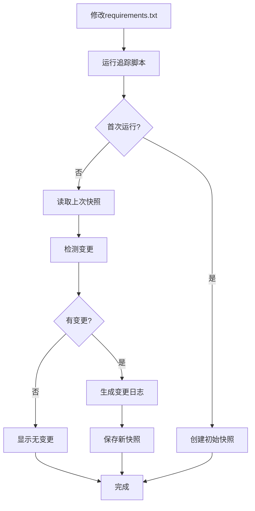

# 📦 Requirements.txt 变更追踪系统使用指南

## 🎯 功能概述

自动追踪Python项目中`requirements.txt`的所有变更,生成结构化的变更日志,帮助团队了解依赖包的演变历史。

### 核心功能
- ✅ **自动对比**: 与上次快照对比,精确识别变更
- ✅ **变更分类**: 新增/删除/版本更新/未变更
- ✅ **变更日志**: 结构化Markdown格式,易读易查
- ✅ **历史快照**: JSON格式保存,可追溯任意历史版本
- ✅ **智能清理**: 自动清理旧快照,节省空间

---

## 🚀 快速开始

### 首次使用

```powershell
# 进入项目目录
cd d:\Python1\O2O_Analysis\O2O数据分析\测算模型

# 创建初始快照 (首次运行)
python tools\track_requirements_changes.py
```

**输出示例:**
```
================================================================================
🔍 开始追踪 requirements.txt 变更
================================================================================
📦 Requirements追踪器初始化完成
   📄 监控文件: requirements.txt
   📁 快照目录: .requirements_snapshots
   📋 变更日志: requirements_changelog.md
✅ 已读取当前requirements.txt
   📦 包数量: 52

ℹ️  未找到历史快照,这是首次追踪

📋 首次追踪,创建初始快照...
✅ 快照已保存: requirements_20251119_143022.json

✅ 初始快照已创建
   📦 记录了 52 个依赖包
   💡 下次运行将开始追踪变更
```

---

## 📝 使用场景

### 场景1: 添加新依赖包

```powershell
# 1. 修改 requirements.txt,添加新包
echo "requests==2.31.0" >> requirements.txt

# 2. 运行追踪并添加说明
python tools\track_requirements_changes.py -r "添加requests库用于API调用"
```

**生成的变更日志:**
```markdown
## 📅 2025-11-19 14:35:20

**变更原因:** 添加requests库用于API调用

### 📊 变更统计

| 类型 | 数量 |
|------|------|
| ✅ 新增 | 1 |
| ❌ 删除 | 0 |
| 🔄 更新 | 0 |
| ⚪ 未变更 | 51 |
| **总计** | **52** |

### ✅ 新增依赖

- **requests** `==2.31.0`

---
```

---

### 场景2: 升级依赖包版本

```powershell
# 1. 修改 requirements.txt,更新版本号
# pandas>=2.0.0 → pandas>=2.1.0

# 2. 运行追踪
python tools\track_requirements_changes.py -r "升级pandas以使用新特性"
```

**生成的变更日志:**
```markdown
## 📅 2025-11-19 14:40:15

**变更原因:** 升级pandas以使用新特性

### 📊 变更统计

| 类型 | 数量 |
|------|------|
| ✅ 新增 | 0 |
| ❌ 删除 | 0 |
| 🔄 更新 | 1 |
| ⚪ 未变更 | 51 |
| **总计** | **52** |

### 🔄 版本更新

- **pandas**: `>=2.0.0` → `>=2.1.0`

---
```

---

### 场景3: 删除不用的依赖

```powershell
# 1. 从 requirements.txt 删除不需要的包
# 例如删除 matplotlib 行

# 2. 运行追踪
python tools\track_requirements_changes.py -r "移除未使用的matplotlib依赖"
```

**生成的变更日志:**
```markdown
## 📅 2025-11-19 14:45:30

**变更原因:** 移除未使用的matplotlib依赖

### 📊 变更统计

| 类型 | 数量 |
|------|------|
| ✅ 新增 | 0 |
| ❌ 删除 | 1 |
| 🔄 更新 | 0 |
| ⚪ 未变更 | 50 |
| **总计** | **51** |

### ❌ 删除依赖

- ~~**matplotlib**~~ `>=3.7.0`

---
```

---

## 🔧 命令参数

### 基本用法

```powershell
python tools\track_requirements_changes.py [选项]
```

### 可用选项

| 选项 | 说明 | 示例 |
|------|------|------|
| `-r, --reason <说明>` | 添加变更原因说明 | `-r "升级安全补丁"` |
| `--show` | 显示当前所有依赖包 | `--show` |
| `--cleanup` | 清理旧快照 | `--cleanup` |
| `--keep <数量>` | 清理时保留的快照数(默认10) | `--keep 20` |

### 命令示例

```powershell
# 基本追踪
python tools\track_requirements_changes.py

# 添加变更说明
python tools\track_requirements_changes.py -r "修复安全漏洞CVE-2024-1234"

# 显示当前所有包
python tools\track_requirements_changes.py --show

# 清理旧快照(保留最新10个)
python tools\track_requirements_changes.py --cleanup

# 清理旧快照(保留最新20个)
python tools\track_requirements_changes.py --cleanup --keep 20
```

---

## 📂 文件结构

```
测算模型/
├── requirements.txt                      # 依赖包清单
├── requirements_changelog.md             # 变更日志(自动生成)
├── .requirements_snapshots/              # 快照目录
│   ├── requirements_20251119_140000.json # 快照1
│   ├── requirements_20251119_143000.json # 快照2
│   └── requirements_20251119_150000.json # 快照3
└── tools/
    └── track_requirements_changes.py     # 追踪工具
```

### 快照文件格式

```json
{
  "timestamp": "2025-11-19T14:30:22.123456",
  "hash": "a1b2c3d4e5f6...",
  "packages": {
    "pandas": ">=2.0.0",
    "numpy": ">=1.24.0",
    "dash": ">=2.14.0"
  },
  "total_packages": 52
}
```

---

## 🔄 工作流程

### 标准工作流



### 团队协作流程

```powershell
# 开发者A: 添加新依赖
echo "beautifulsoup4==4.12.0" >> requirements.txt
python tools\track_requirements_changes.py -r "添加爬虫库"
git add requirements.txt requirements_changelog.md .requirements_snapshots/
git commit -m "feat: 添加beautifulsoup4依赖"
git push

# 开发者B: 拉取更新
git pull
# 查看变更日志了解依赖变化
cat requirements_changelog.md

# 开发者B: 更新依赖包
pip install -r requirements.txt
```

---

## 📊 变更日志示例

完整的`requirements_changelog.md`示例:

```markdown
# Requirements.txt 变更日志

> 自动生成的依赖包变更追踪日志

---

## 📅 2025-11-19 14:30:22

**变更原因:** 初始化项目依赖

### 📊 变更统计

| 类型 | 数量 |
|------|------|
| ✅ 新增 | 52 |
| ❌ 删除 | 0 |
| 🔄 更新 | 0 |
| ⚪ 未变更 | 0 |
| **总计** | **52** |

### ✅ 新增依赖

- **pandas** `>=2.0.0`
- **numpy** `>=1.24.0`
- **dash** `>=2.14.0`
... (更多包)

---

## 📅 2025-11-19 15:45:10

**变更原因:** 升级安全补丁

### 📊 变更统计

| 类型 | 数量 |
|------|------|
| ✅ 新增 | 0 |
| ❌ 删除 | 0 |
| 🔄 更新 | 2 |
| ⚪ 未变更 | 50 |
| **总计** | **52** |

### 🔄 版本更新

- **sqlalchemy**: `==2.0.23` → `==2.0.25`
- **fastapi**: `==0.104.1` → `==0.105.0`

---
```

---

## 🛠️ 高级功能

### 查看当前所有依赖

```powershell
python tools\track_requirements_changes.py --show
```

**输出:**
```
================================================================================
📦 当前依赖包列表 (共 52 个)
================================================================================
  alembic                                  ==1.12.1
  celery                                   ==5.3.4
  dash                                     >=2.14.0
  dash-bootstrap-components                >=1.5.0
  dash-echarts                             >=1.0.0
  fastapi                                  ==0.104.1
  ... (更多包)
================================================================================
```

### 清理旧快照

```powershell
# 保留最新10个快照
python tools\track_requirements_changes.py --cleanup

# 保留最新20个快照
python tools\track_requirements_changes.py --cleanup --keep 20
```

**输出:**
```
🗑️  清理旧快照 (保留最新 10 个)...
   ✅ 已删除: requirements_20251110_120000.json
   ✅ 已删除: requirements_20251111_140000.json
   ... (更多文件)
✅ 清理完成,剩余 10 个快照
```

---

## 🔍 快照查询

### 查看特定时间点的依赖

```powershell
# 进入快照目录
cd .requirements_snapshots

# 查看特定快照
cat requirements_20251119_140000.json | python -m json.tool
```

### Python脚本查询

```python
import json
from pathlib import Path

# 读取快照
snapshot_file = Path('.requirements_snapshots/requirements_20251119_140000.json')
with open(snapshot_file) as f:
    snapshot = json.load(f)

# 查看当时的pandas版本
print(f"pandas版本: {snapshot['packages']['pandas']}")

# 统计包数量
print(f"总包数: {snapshot['total_packages']}")
```

---

## ⚙️ Git集成(可选)

### 方式1: 手动Git提交

```powershell
# 每次修改requirements.txt后
python tools\track_requirements_changes.py -r "变更说明"

# 提交变更
git add requirements.txt requirements_changelog.md .requirements_snapshots/
git commit -m "deps: 更新依赖包"
git push
```

### 方式2: Git Pre-commit Hook(自动化)

创建 `.git/hooks/pre-commit`:

```bash
#!/bin/bash
# 检查requirements.txt是否变更
if git diff --cached --name-only | grep -q "requirements.txt"; then
    echo "检测到requirements.txt变更,运行追踪..."
    python tools/track_requirements_changes.py -r "Git提交前自动追踪"
    
    # 将变更日志和新快照加入暂存
    git add requirements_changelog.md .requirements_snapshots/
    
    echo "✅ 依赖变更已追踪"
fi
```

```powershell
# 设置可执行权限 (Linux/Mac)
chmod +x .git/hooks/pre-commit
```

**效果:**  
每次提交涉及`requirements.txt`的变更时,自动运行追踪并记录。

---

## 📈 最佳实践

### ✅ 推荐做法

1. **及时追踪**: 每次修改`requirements.txt`后立即运行追踪
2. **添加说明**: 使用`-r`参数说明变更原因
3. **提交到Git**: 将变更日志和快照一起提交
4. **定期清理**: 每月清理一次旧快照
5. **团队规范**: 在团队中统一使用此工具

### ❌ 避免的做法

1. ❌ 修改requirements后忘记追踪
2. ❌ 不添加变更说明(难以理解历史)
3. ❌ 手动编辑变更日志(会被覆盖)
4. ❌ 删除快照目录(丢失历史)
5. ❌ 不提交到Git(团队成员看不到)

---

## 🐛 常见问题

### Q1: 首次运行显示"无历史快照"?
**A:** 这是正常的!首次运行会创建初始快照,第二次运行才开始追踪变更。

### Q2: 变更日志被覆盖了?
**A:** 不会!脚本使用追加模式(`append`),不会覆盖已有内容。

### Q3: 快照文件太多怎么办?
**A:** 运行 `python tools\track_requirements_changes.py --cleanup` 清理旧快照。

### Q4: 能否追踪注释的变更?
**A:** 不能。脚本只追踪实际的包和版本,注释变更不会记录。

### Q5: 支持其他格式(如poetry)?
**A:** 当前仅支持`requirements.txt`格式。如需支持`pyproject.toml`,需扩展代码。

### Q6: 如何恢复到历史版本?
```powershell
# 查看历史快照
ls .requirements_snapshots

# 从快照恢复(手动)
# 1. 查看快照内容
cat .requirements_snapshots\requirements_20251119_140000.json

# 2. 手动编辑requirements.txt恢复
```

---

## 📞 技术支持

如遇到问题:
1. 查看脚本输出的错误信息
2. 检查`requirements.txt`格式是否正确
3. 确认Python版本 >= 3.7
4. 查看本文档常见问题部分

---

## 📝 更新日志

| 版本 | 日期 | 变更内容 |
|------|------|----------|
| v1.0 | 2025-11-19 | 初始版本,支持基本追踪功能 |

---

**文档版本:** v1.0  
**最后更新:** 2025-11-19  
**维护人:** AI助手
