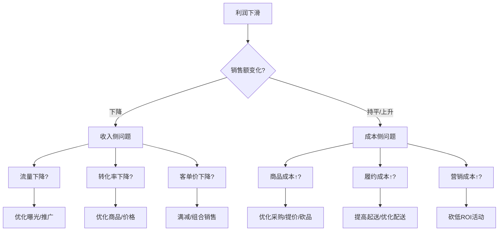

# 业务逻辑核心知识库

> **创建时间**: 2025-10-26  
> **用途**: 所有数据分析、AI洞察、看板功能的业务逻辑基础  
> **重要性**: ⭐⭐⭐⭐⭐ (最高优先级,刻入代码基因)

---

## 一、业务模式定义

### 1.1 核心业态
- **业务类型**: O2O 闪购 (纯线上外卖平台)
- **主要平台**: 美团、饿了么、京东
- **门店规模**: 上千家门店
- **SKU规模**: 6000+ 商品
- **营业模式**: 
  - ✅ 24小时营业制
  - ✅ 仓店一体模式
  - ❌ 线下门店不营业
  - ✅ 纯线上交易

### 1.2 商品分类结构
```
日常生活用品
├─ 个人洗护
├─ 出行必备
├─ 应季商品
├─ 应急商品
└─ ... (几十个日常分类)
```

---

## 二、核心经营目标

### 🎯 最高优先级: **门店利润最大化**

```
核心目标金字塔:
        门店利润 (核心)
            ↑
    ┌───────┴───────┐
收入增长          成本优化
    ↓                ↓
GMV提升          履约成本↓
客单价↑          营销成本↓
转化率↑          平台佣金↓
流量↑            商品成本↓
```

### 关键原则
1. **利润优先**: GMV增长重要,但健康的利润率才是根本
2. **成本敏感**: 严格审视每一分营销支出,追求最高ROI
3. **数据驱动**: 所有决策基于数据洞察
4. **全局视角**: 平衡上千家门店资源,关注整体效益
5. **敏锐应变**: 快速响应市场变化、平台政策、竞对动作

---

## 三、核心分析维度

### 3.1 关键指标体系

#### 📊 收入侧指标
```python
GMV (销售总额)
├─ 流量 (访客数、曝光量)
├─ 转化率 (下单率)
├─ 客单价 (单笔订单金额)
│   ├─ 商品件单价
│   └─ 单笔商品数
└─ 复购率 (用户粘性)
```

#### 💰 利润侧指标
```python
净利润 = 销售额 - 总成本
├─ 商品成本 (采购成本)
├─ 履约成本
│   ├─ 物流配送费
│   └─ 包装费
├─ 平台成本
│   ├─ 平台佣金
│   └─ 平台服务费
└─ 营销成本
    ├─ 折扣补贴
    ├─ 满减活动
    └─ 平台推广费
```

#### ⚠️ 风险指标
```python
亏损门店数量
利润下滑门店占比
低效营销活动比例
高成本商品占比
滞销库存金额
```

### 3.2 分析优先级

| 优先级 | 分析维度 | 关键问题 |
|--------|---------|---------|
| **P0** | **利润分析** | 哪些门店亏损?哪些商品拖累利润? |
| **P0** | **成本结构** | 成本占比是否合理?哪里可以优化? |
| **P1** | **商品结构** | 流量品/利润品配比是否健康? |
| **P1** | **营销ROI** | 哪些活动有效?哪些在烧钱? |
| **P2** | **竞对分析** | 竞对策略如何?我们如何应对? |
| **P2** | **时段场景** | 黄金时段在哪?如何提升坪效? |

---

## 四、业务决策逻辑

### 4.1 问题诊断流程

```
门店亏损/利润下滑
    ↓
【第1步】快速定位关键因素
    ├─ 流量问题? (曝光↓、访客↓)
    ├─ 转化问题? (下单率↓)
    ├─ 客单价问题? (单笔金额↓)
    ├─ 毛利率问题? (成本↑、定价↓)
    ├─ 商品结构问题? (滞销品多、利润品少)
    ├─ 履约成本问题? (配送费↑)
    └─ 营销费用问题? (ROI低、烧钱活动)
    ↓
【第2步】量化影响程度
    计算各因素对利润的贡献度
    ↓
【第3步】制定解决方案
    提出具体的、可执行的策略
    ↓
【第4步】预估效果
    预测优化后的利润提升空间
```

### 4.2 典型决策场景

#### 场景1: 门店亏损
```yaml
诊断路径:
  1. 检查成本结构: 
     - 商品成本占比 > 70%? → 优化采购价或提价
     - 履约成本占比 > 15%? → 优化配送策略
     - 平台佣金占比 > 10%? → 调整平台投放策略
  
  2. 检查商品结构:
     - 流量品占比 > 40%? → 减少低毛利引流品
     - 利润品销量低? → 加大利润品曝光和促销
  
  3. 检查营销效率:
     - 营销费用 > 10%? → 砍掉低ROI活动
     - 折扣力度 > 20%? → 评估是否过度促销

决策建议:
  - 优先级1: 砍掉亏损商品
  - 优先级2: 提升利润品销量
  - 优先级3: 优化履约成本
```

#### 场景2: 利润下滑
```yaml
对比分析:
  - 当前周期 vs 历史周期
  - 找出变化最大的指标
  
下滑归因:
  - GMV下降导致? → 流量/转化/客单价问题
  - 成本上升导致? → 采购/履约/营销成本问题
  - 商品结构变化? → 利润品占比下降

解决策略:
  - 收入侧: 提升流量、转化、客单价
  - 成本侧: 控制履约成本、优化营销ROI
  - 商品侧: 调整商品结构、淘汰低效SKU
```

#### 场景3: 营销活动评估
```yaml
评估指标:
  ROI = (活动带来的增量利润) / (活动成本)
  
判断标准:
  - ROI > 3: 优秀,加大投入
  - ROI 1-3: 合格,持续观察
  - ROI < 1: 亏损,立即停止

优化方向:
  - 精准定位目标用户
  - 优化活动商品组合
  - 控制折扣力度
  - 提高客单价门槛
```

---

## 五、商品角色定位

### 5.1 商品三角色体系

```
        利润品 (赚钱)
         ↗  ↖
       /      \
流量品        形象品
(引流)        (品牌)
```

### 5.2 角色定义与策略

#### 🎯 流量品 (Traffic Products)
**定义**:
- 高频刚需商品
- 价格敏感
- 竞对必有
- 用于引流获客

**特征**:
```python
销量高 (TOP 20%)
毛利率低 (< 15%)
周转快 (售罄率高)
价格竞争激烈
```

**策略**:
- ✅ 保持价格竞争力(但不过度打折)
- ✅ 控制占比(建议 < 30%)
- ✅ 搭配销售,带动利润品
- ❌ 避免单独促销导致亏损

**典型商品**:
- 瓶装水、卫生纸、鸡蛋等

---

#### 💰 利润品 (Profit Products)
**定义**:
- 高毛利商品
- 差异化竞争
- 门店核心盈利来源

**特征**:
```python
毛利率高 (> 30%)
价格不敏感
竞对差异化
贡献主要利润
```

**策略**:
- ✅ 最大化销量(提升曝光、促销)
- ✅ 保护毛利率(谨慎打折)
- ✅ 提高占比(建议 > 40%)
- ✅ 关联推荐

**典型商品**:
- 进口零食、高端洗护、特色商品等

---

#### 🏆 形象品 (Image Products)
**定义**:
- 品牌力强
- 提升门店形象
- 吸引特定客群

**特征**:
```python
品牌知名度高
价格中高端
毛利率中等 (15-30%)
提升客户信任
```

**策略**:
- ✅ 维持品质和服务
- ✅ 适度促销引流
- ✅ 控制占比(建议 20-30%)

**典型商品**:
- 知名品牌商品、进口商品等

---

### 5.3 健康商品结构

```
理想配比:
┌─────────────────────────────┐
│ 流量品: 25-30%               │ 引流获客
├─────────────────────────────┤
│ 利润品: 40-50%               │ 核心盈利
├─────────────────────────────┤
│ 形象品: 20-25%               │ 品牌提升
└─────────────────────────────┘

风险信号:
❌ 流量品 > 40%  → 利润承压
❌ 利润品 < 30%  → 赚钱能力不足
❌ 滞销品 > 20%  → 库存风险
```

---

## 六、时段场景业务逻辑

### 6.1 24小时时段特征

| 时段 | 时间范围 | 业务特征 | 策略重点 |
|------|---------|---------|---------|
| **清晨** | 6-9点 | 早餐刚需、上班族 | 快速配送,早餐组合 |
| **上午** | 9-12点 | 日常补货、老年客群 | 日用品推荐 |
| **正午** | 12-14点 | 午餐高峰、白领 | 提升客单价,午餐套餐 |
| **下午** | 14-18点 | 下午茶、休闲 | 零食饮品推荐 |
| **傍晚** | 18-21点 | 晚餐高峰、家庭 | 生鲜蔬菜,家庭装 |
| **晚间** | 21-24点 | 夜宵、宅家 | 零食酒水,娱乐商品 |
| **深夜** | 0-3点 | 夜间应急 | 应急商品,高毛利 |
| **凌晨** | 3-6点 | 少量应急 | 减少备货,控成本 |

### 6.2 黄金时段识别

```python
黄金时段判定标准:
1. 订单量 > 平均值 × 1.5
2. 客单价 > 平均值
3. 利润率 > 20%
4. 转化率 > 平均值

策略:
- 黄金时段: 加大曝光,提高备货
- 低谷时段: 控制成本,优化库存
```

---

## 七、成本控制逻辑

### 7.1 成本结构基准

```
健康成本结构 (占销售额比例):
┌─────────────────────────────┐
│ 商品成本: 55-65%             │
├─────────────────────────────┤
│ 履约成本: 8-12%              │
│  ├─ 配送费: 5-8%             │
│  └─ 包装费: 2-4%             │
├─────────────────────────────┤
│ 平台成本: 5-8%               │
│  ├─ 佣金: 3-5%               │
│  └─ 服务费: 2-3%             │
├─────────────────────────────┤
│ 营销成本: 3-8%               │
│  ├─ 折扣补贴: 2-5%           │
│  └─ 推广费: 1-3%             │
├─────────────────────────────┤
│ 净利润率: 8-15%              │
└─────────────────────────────┘

风险阈值:
❌ 商品成本 > 70%  → 毛利率过低
❌ 履约成本 > 15%  → 配送效率问题
❌ 营销成本 > 10%  → ROI过低,烧钱
❌ 净利润率 < 5%   → 亏损风险
```

### 7.2 成本优化策略

#### 商品成本优化
```yaml
策略:
  1. 优化采购价: 与供应商谈判,批量采购
  2. 调整定价: 提高利润品售价
  3. 淘汰低毛利商品: 砍掉毛利率 < 10% 的商品
  4. 动态定价: 根据时段、库存调整价格
```

#### 履约成本优化
```yaml
策略:
  1. 优化配送范围: 缩小覆盖半径
  2. 提高起送金额: 减少低客单价订单
  3. 时段差异化: 高峰期提高配送费
  4. 包装优化: 使用标准化包装
```

#### 营销成本优化
```yaml
策略:
  1. ROI监控: 实时评估活动效果
  2. 精准投放: 针对高价值用户
  3. 控制折扣: 避免过度促销
  4. 砍掉低效活动: ROI < 1 立即停止
```

---

## 八、AI分析指导原则

### 8.1 AI分析必备上下文

所有AI分析必须包含以下业务背景:

```python
业务背景 = {
    "业务类型": "O2O闪购(纯线上外卖)",
    "经营模式": "24小时营业,仓店一体,上千家门店",
    "核心目标": "门店利润最大化",
    "SKU规模": "6000+商品",
    "主要平台": "美团、饿了么、京东",
    
    "关键成本": {
        "商品成本": "55-65%",
        "履约成本": "8-12%",
        "平台成本": "5-8%",
        "营销成本": "3-8%"
    },
    
    "决策原则": [
        "利润优先(不盲目追求GMV)",
        "成本敏感(严控每分支出)",
        "数据驱动(所有决策基于数据)",
        "全局视角(上千家门店资源平衡)",
        "敏锐应变(快速响应市场变化)"
    ]
}
```

### 8.2 AI输出要求

#### ✅ 必须包含的内容:
1. **问题定位**: 清晰指出核心问题(流量/转化/成本/商品结构等)
2. **量化分析**: 用数据说明问题严重程度
3. **归因分析**: 找出根本原因,不停留在表象
4. **解决方案**: 提供3-5个具体的、可执行的策略
5. **效果预估**: 预测优化后的利润提升空间
6. **优先级排序**: 按ROI和可行性排序建议
7. **风险提示**: 指出潜在风险和注意事项

#### ❌ 禁止输出的内容:
1. ❌ 空泛的建议(如"提升用户体验")
2. ❌ 无法量化的方案
3. ❌ 忽略成本的增长建议
4. ❌ 盲目追求GMV增长
5. ❌ 缺乏优先级的建议清单

#### 示例对比:

**❌ 错误示例**:
```
建议:
1. 提升用户体验
2. 加强营销推广
3. 优化商品结构
```

**✅ 正确示例**:
```
【问题定位】门店利润率从12%下降至6%,主要原因:
  1. 流量品占比从28%上升至45% (拖累毛利率)
  2. 营销成本从5%上升至11% (ROI仅0.8,严重亏损)
  3. 履约成本从9%上升至14% (低客单价订单增多)

【量化影响】
  - 商品结构问题导致毛利率下降4个百分点 → 损失¥12万/月
  - 低效营销活动烧钱 → 损失¥8万/月
  - 履约成本失控 → 损失¥5万/月

【解决方案】(按ROI排序)
  1. 立即停止ROI<1的营销活动 (预计挽回¥8万/月)
  2. 提高起送金额至¥25 (预计降低履约成本¥3万/月)
  3. 砍掉毛利率<10%的流量品 (预计提升毛利率2% → ¥6万/月)
  4. 加大利润品曝光(满¥50推荐) (预计增加利润¥4万/月)

【效果预估】
  总计可提升利润: ¥21万/月 (利润率从6%恢复至10%)

【执行优先级】
  P0: 停止低ROI活动 (立即执行,0成本,高收益)
  P1: 提高起送金额 (3天内完成)
  P2: 优化商品结构 (1周内完成)

【风险提示】
  - 提高起送金额可能导致订单量下降5-10%,但客单价提升会弥补
  - 砍掉流量品需评估对总流量的影响,建议逐步替换
```

### 8.3 AI分析模板

```markdown
# AI智能分析报告

## 📊 数据概览
[核心指标现状]

## 🔍 问题诊断
### 关键问题
[用数据说明问题]

### 归因分析
[深挖根本原因]

## 💡 解决方案
### 方案1: [方案名称] (ROI: X.X, 优先级: PX)
- **执行内容**: [具体做什么]
- **预期效果**: [量化收益]
- **实施难度**: [低/中/高]
- **执行周期**: [X天]

### 方案2: ...

## 📈 效果预估
- 总计可提升利润: ¥XXX
- 预计利润率: X% → Y%
- ROI: X.X

## ⚠️ 风险提示
[潜在风险和注意事项]

## 🎯 执行建议
1. 立即执行: [...]
2. 短期执行(1周内): [...]
3. 中期执行(1月内): [...]
```

---

## 九、看板开发指导原则

### 9.1 功能优先级

```
P0 (核心功能,必须有):
├─ 门店利润分析
├─ 成本结构分析
├─ 商品角色分析
├─ 亏损/下滑诊断
└─ 营销ROI分析

P1 (重要功能,应该有):
├─ 时段场景分析
├─ 竞对对比分析
├─ 商品组合分析
└─ 预警提示

P2 (增强功能,可以有):
├─ 趋势预测
├─ 智能推荐
└─ 自定义报表
```

### 9.2 交互设计原则

1. **突出重点**: 利润指标放最显眼位置
2. **快速筛选**: 常用条件(时间/门店/商品)一键切换
3. **对比分析**: 默认开启同环比对比
4. **风险提示**: 异常数据红色高亮
5. **操作指引**: 每个分析结果给出明确建议

### 9.3 数据展示原则

```python
指标展示优先级:
1. 利润额 & 利润率 (最重要)
2. 成本结构 (占比饼图)
3. GMV & 客单价
4. 商品角色分布
5. 时段场景分析
```

---

## 十、代码实现要求

### 10.1 核心计算逻辑

```python
# 利润计算 (标准公式)
净利润 = 销售额 - 商品成本 - 履约成本 - 平台成本 - 营销成本

# 利润率计算
利润率 = (净利润 / 销售额) × 100%

# 商品角色判定
def classify_product_role(row):
    毛利率 = row['毛利率']
    销量排名 = row['销量排名百分位']
    
    if 毛利率 > 30%:
        return '利润品'
    elif 销量排名 < 20% and 毛利率 < 15%:
        return '流量品'
    elif 毛利率 >= 15% and 毛利率 <= 30%:
        return '形象品'
    else:
        return '普通品'

# 健康度评估
def assess_health(metrics):
    warnings = []
    
    if metrics['利润率'] < 5%:
        warnings.append('⚠️ 利润率过低,亏损风险')
    if metrics['商品成本占比'] > 70%:
        warnings.append('⚠️ 商品成本过高')
    if metrics['履约成本占比'] > 15%:
        warnings.append('⚠️ 履约成本失控')
    if metrics['营销成本占比'] > 10%:
        warnings.append('⚠️ 营销费用过高')
    if metrics['流量品占比'] > 40%:
        warnings.append('⚠️ 流量品占比过高')
    if metrics['利润品占比'] < 30%:
        warnings.append('⚠️ 利润品占比不足')
    
    return warnings
```

### 10.2 AI Prompt 模板

```python
AI_PROMPT_TEMPLATE = """
你是一位资深的O2O零售运营专家,专门负责上千家闪购门店的利润优化。

【业务背景】
- 业务类型: 纯线上外卖闪购(美团/饿了么/京东)
- 经营模式: 24小时营业,仓店一体,6000+ SKU
- 核心目标: 门店利润最大化
- 健康利润率: 8-15%
- 成本结构: 商品成本55-65%,履约8-12%,平台5-8%,营销3-8%

【决策原则】
1. 利润优先: GMV增长重要,但健康利润率才是根本
2. 成本敏感: 严格审视每一分支出,追求最高ROI
3. 数据驱动: 所有决策基于数据洞察
4. 全局视角: 平衡上千家门店资源
5. 敏锐应变: 快速响应市场变化

【当前数据】
{data_summary}

【分析任务】
{analysis_task}

【输出要求】
1. 问题定位: 清晰指出核心问题(流量/转化/成本/商品结构等)
2. 量化分析: 用数据说明问题严重程度
3. 归因分析: 找出根本原因
4. 解决方案: 3-5个具体可执行的策略,按ROI排序
5. 效果预估: 预测优化后的利润提升空间
6. 风险提示: 指出潜在风险

请基于以上背景,提供专业的分析和建议。
"""
```

---

## 十一、常见问题决策树

### 11.1 利润下滑诊断



### 11.2 门店亏损诊断

```yaml
诊断步骤:
  步骤1: 检查成本结构
    - 商品成本 > 70%? → 采购价或定价问题
    - 履约成本 > 15%? → 配送效率问题
    - 营销成本 > 10%? → 烧钱问题
  
  步骤2: 检查商品结构
    - 流量品 > 40%? → 利润品不足
    - 滞销品 > 20%? → 库存风险
    - 毛利率 < 25%? → 定价策略问题
  
  步骤3: 检查营销效率
    - ROI < 1? → 立即停止
    - 折扣 > 20%? → 过度促销
  
  步骤4: 制定方案
    - 优先级1: 砍亏损商品/活动
    - 优先级2: 提升利润品销量
    - 优先级3: 优化成本结构
```

---

## 十二、关键业务术语

```python
# 业务术语词典
BUSINESS_TERMS = {
    "闪购": "外卖平台的即时零售业务,30分钟-1小时送达",
    "仓店一体": "仓库和门店合一,只做线上不做线下",
    "流量品": "高频刚需,低毛利,用于引流的商品",
    "利润品": "高毛利,差异化,主要盈利来源的商品",
    "形象品": "品牌力强,提升门店形象的商品",
    "履约成本": "配送费+包装费+其他履约费用",
    "平台成本": "平台佣金+服务费+推广费",
    "营销成本": "折扣补贴+满减+优惠券+推广费",
    "ROI": "投资回报率 = 收益/成本",
    "客单价": "单笔订单金额(商品金额,不含配送费)",
    "毛利率": "(销售额-商品成本)/销售额",
    "净利润率": "净利润/销售额",
    "动销率": "有销量的SKU/总SKU",
    "售罄率": "售罄SKU/有销量SKU",
    "坪效": "单位面积产出(营业额或利润)",
    "GMV": "商品交易总额(Gross Merchandise Volume)"
}
```

---

## 十三、核心要求清单

### ✅ 所有功能必须遵守:

- [ ] 以**门店利润**为核心指标
- [ ] 严格区分**流量品/利润品/形象品**
- [ ] 所有成本按标准占比评估
- [ ] 营销活动必须计算ROI
- [ ] 亏损/下滑必须快速定位原因
- [ ] 所有建议必须量化可执行
- [ ] AI分析必须包含业务背景
- [ ] 数据展示突出利润相关指标
- [ ] 风险指标红色高亮预警
- [ ] 提供优先级排序的建议

### ⚠️ 禁止事项:

- [ ] ❌ 盲目追求GMV增长
- [ ] ❌ 忽略成本的增长建议
- [ ] ❌ 空泛的无法执行的建议
- [ ] ❌ 缺少量化的分析结论
- [ ] ❌ 没有优先级的建议清单
- [ ] ❌ 忽略上千家门店的全局视角
- [ ] ❌ 不考虑24小时营业的时段特性
- [ ] ❌ 遗漏ROI评估的营销分析

---

## 十四、持续更新机制

本知识库将随着业务发展持续更新:

```yaml
更新周期: 每月评审一次
更新内容:
  - 成本结构基准调整
  - 商品角色判定标准优化
  - 新增业务场景和决策逻辑
  - AI分析模板迭代
  - 风险阈值校准

更新负责人: AI助手 + 业务负责人
版本记录: 见文件底部
```

---

**最后更新**: 2025-10-26  
**版本**: v1.0  
**状态**: ✅ 已刻入代码基因,所有分析和开发必须遵循本知识库
